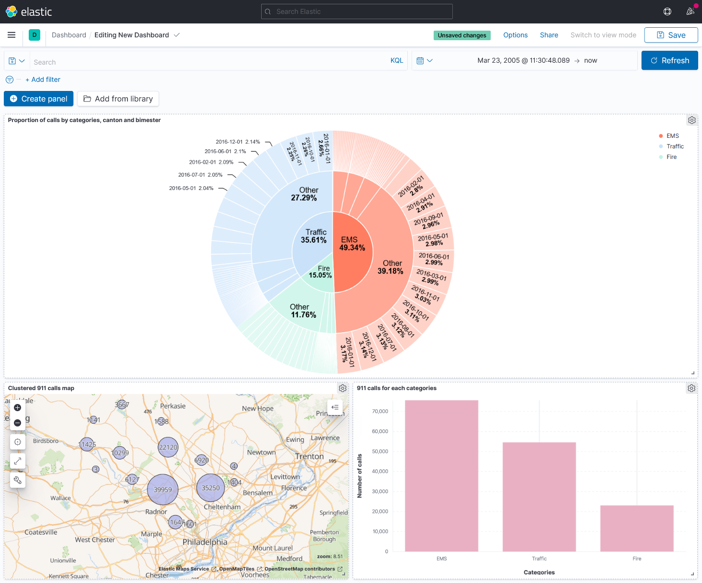

# 911 Calls avec ElasticSearch

## Import du jeu de données

Pour importer le jeu de données, complétez le script `import.js` (ici aussi, cherchez le `TODO` dans le code :wink:).

Exécutez-le ensuite :

```bash
npm install
node import.js
```

Vérifiez que les données ont été importées correctement grâce au shell (le nombre total de documents doit être `153194`) :

```
GET <nom de votre index>/_count
```

## Requêtes

À vous de jouer ! Écrivez les requêtes ElasticSearch permettant de résoudre les problèmes posés.

REQUETE 1
POST /calls/_search
{
  "size": 0,
  "aggs": {
    "title1": {
      "terms": {
        "field": "title1.keyword"
      }
    }
  }
}

REQUETE 2
POST /calls/_search
{
  "size": 0,
  "aggs": {
    "timeStamp": {
      "terms": {
        "field": "timeStamp.keyword",
        "size" : 3,
        "order": { "_count": "desc" }
      }
    }
  }
}

REQUETE 3
POST /calls/_search
{
  "query" : {
    "wildcard" : {
      "title2" : {
        "value" : "*OVERDOSE*"
      }
    }
  },
  "size": 0,
  "aggs": {
    "twp": {
      "terms": {
        "field": "twp.keyword",
        "size" : 3,
        "order": { "_count": "desc" }
      }
    }
  }
}

REQUETE 4
GET /calls/_count
{
  "query": {
    "bool" : {
      "filter" : {
        "geo_distance" : {
          "distance" : "500m",
          "location" : "40.241493, -75.283783"
        }
      }
    }
  }
}

## Kibana

Dans Kibana, créez un dashboard qui permet de visualiser :

* Une carte de l'ensemble des appels
* Un histogramme des appels répartis par catégories
* Un Pie chart réparti par mois, par catégories et par canton (township)




### Bonus : Timelion
Timelion est un outil de visualisation des timeseries accessible via Kibana à l'aide du bouton : 

Réalisez le diagramme suivant :


Envoyer la réponse sous la forme de la requête Timelion ci-dessous:  

```
TODO : ajouter la requête Timelion ici
```
